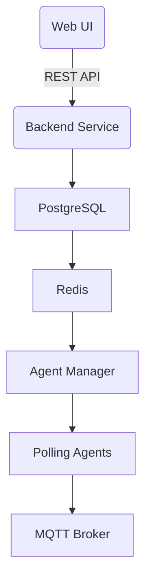

Web UI manages tag requests
Backend manages requests and updates database
Redis cache config and TTL block device configs
Agents get assigned devices. (Based on kuberetes service loading, spinning up new pods as required)
Data gathered is published over MQTT for ingestion

Future capability for data governance in Web UI and on the fly batch contextualisation.